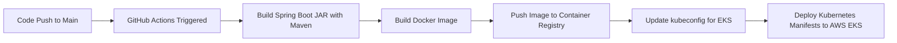

# Devops-Application 🚀

A **Spring Boot microservice** deployed on **AWS EKS** with a complete **DevOps pipeline**.  
This project demonstrates modern DevOps practices including **CI/CD with GitHub Actions**, **containerization with Docker**, and **infrastructure setup with Kubernetes manifests** (deployments, services, persistent volumes, and service accounts).  

---

## 🔹 Features

- **Spring Boot Application** – REST-based backend service.
- **CI/CD Pipeline (GitHub Actions)** – Automates build, test, Docker image creation, and deployment to EKS.
- **Dockerized Service** – Lightweight containerization with a `Dockerfile`.
- **Kubernetes Manifests** – Deployment, Service, PV, PVC, and ServiceAccount YAMLs for EKS.
- **AWS EKS Integration** – Production-grade orchestration with scaling and self-healing.
- **Infrastructure as Code** – All setup/config YAMLs tracked in Git.

---

## 🔹 Repository Structure

```bash
Devops-Application/
├── src/                  # Spring Boot application source code
├── .github/workflows/    # GitHub Actions CI/CD pipelines
│   └── cicd.yml
├── Dockerfile
├── deployment/                  # Kubernetes manifests for deployment,service and EFS mounts
│   ├── deployment.yml
│   ├── setup.yml
│   └── efs-pvc.yml
├── setup/                # Setup manifests for cluster resources
│   └── rbac.yaml
└── README.md
```
## ⚙️ CI/CD Pipeline (GitHub Actions)

This repository includes a **GitHub Actions pipeline** that automates:

1. **Build & Test** – Compile Spring Boot application with Maven  
2. **Docker Build & Push** – Build Docker image and push to DockerHub (or AWS ECR)  
3. **Deploy to EKS** – Apply Kubernetes manifests to AWS EKS cluster  

### Workflow File: `.github/workflows/cicd.yml`

```yaml
name: CI/CD - Deploy Spring Boot to EKS

on:
  push:
    branches:
      - main   # Trigger deployment only on main branch
      - feature/adding-connections

jobs:
  build-and-deploy:
    runs-on: ubuntu-latest

    permissions:
      contents: read
      id-token: write

    steps:
      # Checkout repo
      - name: Checkout code
        uses: actions/checkout@v4

      # Setup JDK
      - name: Set up JDK 21
        uses: actions/setup-java@v4
        with:
          java-version: '21'
          distribution: 'temurin'
      - name: Dependency Vulnerability Scan
        uses: dependency-check/Dependency-Check_Action@main
        with:
          project: 'Devops-Application'
          path: '.'
          format: 'HTML'
          out: 'reports'
      # Build Spring Boot app
      - name: Build with Maven
        run: mvn clean package -DskipTests

      # Configure AWS credentials (from GitHub OIDC or stored secrets)
      - name: Configure AWS credentials
        uses: aws-actions/configure-aws-credentials@v4
        with:
          role-to-assume: ${{ secrets.AWS_ROLE_ARN }}
          aws-region: us-east-1

      # Login to Amazon ECR
      - name: Login to Amazon ECR
        id: login-ecr
        uses: aws-actions/amazon-ecr-login@v2

      # Build and push Docker image
      - name: Build, Tag, and Push image to ECR
        env:
          ECR_REGISTRY: ${{ steps.login-ecr.outputs.registry }}
          ECR_REPOSITORY: spring-app
          IMAGE_TAG: ${{ github.sha }}
        run: |
          docker build -t $ECR_REGISTRY/devops-ecr-prod:latest .
          docker push $ECR_REGISTRY/devops-ecr-prod:latest
      - name: Scan Docker Image for vulnerabilities
        uses: aquasecurity/trivy-action@master
        with:
          image-ref: devops-ecr-prod:latest
      # Update kubeconfig for EKS
      - name: Update kubeconfig
        run: aws eks update-kubeconfig --region us-east-1 --name devops-eks-prod

      # Deploy to EKS
      - name: Deploy to EKS
        env:
          ECR_REGISTRY: ${{ steps.login-ecr.outputs.registry }}
          ECR_REPOSITORY: spring-app
          IMAGE_TAG: ${{ github.sha }}
        run: |
          kubectl apply -f deployment/deployment.yml

```
### 📈 Workflow Summary

The CI/CD pipeline follows these stages:

1. **Code Push** – Developer pushes code to the `main` branch  
2. **Build & Test** – Maven builds the Spring Boot app  
3. **Docker Build & Push** – Docker image is built and pushed to registry (DockerHub/ECR)  
4. **Deploy to EKS** – Kubernetes manifests are applied to AWS EKS  


## 🐳 Docker Setup

The application is containerized using **Docker**.  
This allows consistent builds and easy deployment to any environment.

### 📄 Dockerfile

```dockerfile
FROM openjdk:17-jdk-slim
WORKDIR /app
COPY target/devops-app.jar app.jar
EXPOSE 8080
ENTRYPOINT ["java", "-jar", "app.jar"]
```
Build and run locally:
```bash
docker build -t devops-app .
docker run -p 8080:8080 devops-app
```
## ☸️ Kubernetes Manifests
### deployment.yml
```yaml
apiVersion: apps/v1
kind: Deployment
metadata:
  name: devops-app
  namespace: devops-app
  labels:
    app: devops-app
spec:
  replicas: 2
  selector:
    matchLabels:
      app: devops-app
  template:
    metadata:
      labels:
        app: devops-app
    spec:
      serviceAccountName: devops-sa
      containers:
        - name: devops-app
          image: 904331955008.dkr.ecr.us-east-1.amazonaws.com/devops-ecr-prod:latest
          imagePullPolicy: Always
          ports:
            - containerPort: 8080
          env:
            - name: SPRING_PROFILES_ACTIVE
              value: "prod"
            - name: AWS_REGION
              value: "us-east-1"
            - name: SPRING_CLOUD_AWS_SECRETSMANAGER_NAME
              value: "devops-secretmanager"
            - name: DB_PASSWORD
              valueFrom:
                secretKeyRef:
                  name: db-secret
                  key: DB_PASSWORD
          securityContext:
            runAsUser: 1000
            runAsGroup: 1000
            runAsNonRoot: true
            allowPrivilegeEscalation: false
            capabilities:
              drop:
                - ALL
            readOnlyRootFilesystem: false
          resources:
            requests:
              cpu: "250m"
              memory: "512Mi"
            limits:
              cpu: "500m"
              memory: "1Gi"
          volumeMounts:                    # ⬅️ mount PVC inside container
            - name: efs-storage
              mountPath: /mnt/efs
      volumes:                             # ⬅️ reference the PVC
        - name: efs-storage
          persistentVolumeClaim:
            claimName: efs-claim
      securityContext:
        fsGroup: 2000
      terminationGracePeriodSeconds: 30
---
apiVersion: v1
kind: Service
metadata:
  name: devops-app
  namespace: devops-app
  labels:
    app: devops-app
spec:
  selector:
    app: devops-app
  ports:
    - protocol: TCP
      port: 80
      targetPort: 8080
  type: ClusterIP
```

### Apply resources
```bash
kubectl apply -f deployment.yml
```
#### Check status
```bash
kubectl get pods -n devops-app
kubectl get svc -n devops-app
```
---
## 🛠️ Tech Stack

This project demonstrates a modern DevOps toolchain:

- **Backend Framework**: Spring Boot (Java 17)
- **Build Tool**: Maven
- **CI/CD**: GitHub Actions
- **Containerization**: Docker
- **Orchestration**: Kubernetes (Amazon EKS)
- **Cloud Platform**: AWS (EKS, IAM, LoadBalancer, PVs)
- **Configuration Management**: YAML-based Kubernetes manifests
- **Registry**: AWS ECR
---
## 📌 Highlights

This project showcases key DevOps skills:

- ✅ Implemented **end-to-end CI/CD pipeline** with GitHub Actions  
- ✅ **Containerized Spring Boot application** using Docker  
- ✅ Automated deployment to **AWS EKS with Kubernetes manifests**  
- ✅ Configured **RBAC, ServiceAccounts, PVs, and PVCs** in Kubernetes  
- ✅ Used **Infrastructure as Code** by managing all manifests in Git  
- ✅ Built a **GitOps-style workflow** for consistent and reproducible deployments  

> 🏆 **This repository serves as a DevOps case study** that highlights my ability to design, implement, and automate cloud-native deployments.
---
## ▶️ Run Locally

Follow these steps to run the application locally using Docker.

---

### 1️⃣ Clone the Repository

```bash
git clone https://github.com/your-username/Devops-Application.git
cd Devops-Application
```
### 2️⃣ Build the Application

Use Maven to package the Spring Boot application:
```bash
mvn clean package -DskipTests
```
This will generate the JAR file under target/devops-app.jar.
### 3️⃣ Build and Run with Docker
```bash
docker build -t devops-app .
docker run -d -p 8080:8080 devops-app
```
### 4️⃣ Access the Application
Open your browser or use curl:
```bash
http://localhost:8080
```
## 🔮 Future Improvements

Planned enhancements to make this project more production-ready:

- 🧩 **Helm Charts** → Package Kubernetes manifests for easier deployment and versioning   
- 📊 **Monitoring & Logging** → Integrate Prometheus, Grafana, and ELK/EFK stack  
- 🔐 **Security** → Add image scanning, secrets management, and RBAC hardening  
- 🚀 **Blue-Green / Canary Deployments** → Improve release strategy with zero-downtime rollouts  
- ☁️ **Multi-Environment Setup** → Separate dev/staging/prod clusters with GitOps workflows  
- 🛡️ **Service Mesh** → Integrate Istio/Linkerd for observability, traffic management, and security  
